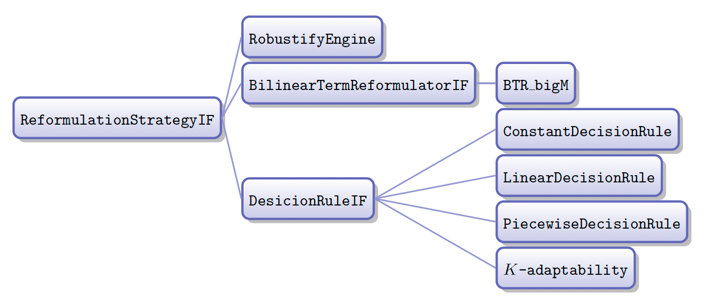

# ROCPP
## Introduction
ROC++ is a C++ based platform for modeling, automatically reformulating, and solving robust optimization problems. 

ROC++ can address both single- and multi-stage problems involving exogenous and/or endogenous uncertain parameters and real- and/or binary-valued adaptive variables. 

Please visit our [website](https://sites.google.com/usc.edu/robust-opt-cpp/home) for more detailed information.

## How to use
### Dependencies
ROC++ requires at least one of the following MILP solvers:
* [GUROBI](https://www.gurobi.com/)
* [SCIP](https://www.scipopt.org/)
    * Note that SCIP needs at least one LP solver. The supported LP solver interfaces are listed [here](https://www.scipopt.org/doc/html/LPI.php).
    * If you want to solve a nonlinear MIP porblem, you need to have at least one of the [NLP solvers](https://www.scipopt.org/doc/html/NLPISOLVERS.php) supported by SCIP.
    * The compilation instructions of SCIP are [here](https://www.scipopt.org/doc/html/CMAKE.php) using CMake and [here](https://www.scipopt.org/doc/html/MAKE.php) using Makefiles.
For Windows users, [Visual Studio](https://visualstudio.microsoft.com/vs/) is needed for compiling the library. We recommend VS2019 but other versions should also work. Please make sure the `Desktop development with C++` is also installed, you can check and install it in the Visual Studio Installer.
### Compiling the project
#### ROCPP project
After installing the solvers, `ROCPP` can be built using CMake by running the following commands:   
```bash
mkdir build
cd build
```
For macOS and Linux users, these should be entered in the command line; for Windows users, in the Visual Studio Developer Command Prompt.

The next command is used to build a project by specifying which example to run and which solver to use. If you choose GUROBI as the solver, you need to specify the path to gurobi in `GUROBI_DIR`:
```bash
# use the following line to choose SCIP as the solver
cmake -DEXAMPLE=EXAMPLE_NAME -DSOLVER=SCIP ..
# or use the follwoing line to choose Gurobi as the solver and also specify the path to Gurobi
cmake -DEXAMPLE=EXAMPLE_NAME -DGUROBI_DIR=/path/to/gurobi ..
```
The following table lists detailed information on CMake options:
|CMake Options|Available Values|Description|
|:-----------:|:--------------:|:---------------------------------------------------------------------------------------------------|
|EXAMPLE      |BB, RSFC, PB    |Name of the example to run from the folder `scripts/examples_cpp`; it can also be the name of user created .cpp files|
|SOLVER       |GUROBI, SCIP    |Name of the solver to use; GUROBI by default|
|GUROBI_DIR   |-               |Path to the folder which contains the Gurobi `lib` and `include` folders|

Example:
```bash
cmake -DEXAMPLE=BB -DGUROBI_DIR=/Library/gurobi902/mac64 ..
```
Now we need to build the project. In macOS or Linux, use the command:
```bash
make
```
In Windows, use the command:
```bash
msbuild ROCPP.sln
```
The executable generated can be found in `bin`. In macOS, you need to give the system permission to run this executable. A library `ROCPP.a` will also be created and put in the folder `lib`.

#### ROPy library
We use [pybind11](https://pybind11.readthedocs.io/en/stable/index.html) to create Python bindings of the C++ code. 

We add pybind11 as a submodule of this repo. 
If you clone this repo, an empty `pybind11` directory will be created. Run the following commands to initialize the local configuration files and fetch the data. 
```bash
git submodule init
git submodule update
```
If you directly download the .zip, then there will be an empty pybind11 directory. You need to download it [here](https://github.com/pybind/pybind11) and replace the empty one.

Now we are able to build the `ROPy` library using the following steps. Note that we do not need to create a new build folder if it already existed.
For macOS and Linux, in the command line, type: 
```bash
mkdir build
cd build
# use the following line to choose SCIP as the solver
cmake -DBUILD_PYTHON=ON -DSOLVER=SCIP ..
# or use the follwoing line to choose Gurobi as the solver and also specify the path to Gurobi
cmake -DBUILD_PYTHON=ON -DGUROBI_DIR=/path/to/gurobi ..
make
```
For Windows, in the Visual Studio Developer Command Prompt, enter:
```bash
mkdir build
cd build
# use the following line to choose SCIP as the solver
cmake -DBUILD_PYTHON=ON -DSOLVER=SCIP ..
# or use the follwoing line to choose Gurobi as the solver and also specify the path to Gurobi
cmake -DBUILD_PYTHON=ON -DGUROBI_DIR=/path/to/gurobi ..
msbuild ROPy.sln
```

For Windows users, if there is a `/bigobj` issue, please double click to open the `ROPy.sln` file, follow the instruction [here](https://docs.microsoft.com/en-us/cpp/build/reference/bigobj-increase-number-of-sections-in-dot-obj-file?view=msvc-170) and rebuild the project directly from Visual Studio by clicking `build` on the menu bar. A library `ROPy.python-version.so` will be created and put in the folder `lib`. To use the library, put it in the same directory as the python files and add a line `from ROPy import *` at the top of the file. See more examples in the `scripts/examples_py` folder.
  
## Replicating
To replicate the results in the paper, run the RSFC, PB, and BB examples by following the instructions above. We also summarize the data in the appendix of the [paper](http://www.optimization-online.org/DB_FILE/2020/06/7835.pdf).

## Getting Started
In this section, we briefly describe how to build optimization models and apply the reformulation methods. For more detailed class structure of our platform, please see the [doxygen documenation](https://robust-opt-cpp.github.io/ROCPPDocumentation/). In the example snippets, the first line is coded in C++ and the second in Python.

### Model Input
**Optimization Model**

The script should start by declaring and building an optimization model. We list several most frequently used model types here.
- UncSSOptModel stands for uncertain single-stage optimization model, which only involve static decision variables;
```C++
ROCPPOptModelIF_Ptr Model(new ROCPPUncSSOptModel(uncOptModelObjType objType = robust));
```
```python
Model = ROPyUncSSOptModel(objType = uncOptModelObjType.robust) 
```
- OptModelExoID stands for optimization model with exogenous information discovery;
```C++
ROCPPOptModelIF_Ptr Model(new ROCPPOptModelExoID(int timeStage, uncOptModelObjType objType = robust));
```
```python
Model = ROPyOptModelExoID(int timeStage, objType = uncOptModelObjType.robust) 
```
- OptModelDDID stands for optimization model with decision-dependent information discovery;
```C++
ROCPPOptModelIF_Ptr Model(new ROCPPOptModelDDID(int timeStage, uncOptModelObjType objType = robust));
```
```python
Model = ROPyOptModelDDID(int timeStage, objType = uncOptModelObjType.robust) 
```
**Note**: Our platform has limited support of stochastic optimization problem, for which the objType should be set to 'stochastic' or 'uncOptModelObjType.stochastic' in C++ and Python, respectively.

**Decision Varaible**

The next components of an optimization model that need to be defined are decision variables. ROC++ contains six types of decision variables: static and adaptive variables that can be binary, integer, or real valued:
- Static real-valued decisions:
```C++
ROCPPVarIF_Ptr x(new ROCPPStaticVarDouble(string varName, double lb = -INFINITY, double ub = INFINITY);
```
```python
x = ROPyStaticVarDouble(string varName, float lb = -INFINITY, float ub = INIFINITY)
```
- Adaptive real-valued decisions:
```C++
ROCPPVarIF_Ptr x(new ROCPPAdaptVarDouble(string varName, int timeStage, double lb = -INFINITY, double ub = INFINITY);
```
```python
x = ROPyAdaptVarDouble(string varName, int timeStage, float lb = -INFINITY, float ub = INFINITY)
```
Binary and integer valued variables can be built in a similar way, by changing `Double' to `Bool' and `Int', respectively.

**Uncertain Parameter**

There are two types for uncertain parameters: exogenous and endogenous parameters whose time of revelation is decision-independent and decision-dependent, respectively. We specify endogenous parameters by calling an additional function after the variable declaration.
- Create Uncertain Parameter
```C++
ROCPPUnc_Ptr unc(new ROCPPUnc(string uncName, int timeStage = 1));
```
```python
unc = ROPyUnc(string uncName, int timeStage = 1)
```
The 'timeStage' argument represents the time period when the uncertain parameter is observed if the uncertain parameter is exogenous. For parameters whose time of revelation is endogenous, we can set 'timeStage = 1'.

- Specify that this is an endogenous uncertain parameter in this model
```C++
Model->add_ddu(ROCPPUnc_Ptr unc, int firstObservableTimeStage, int lastObservableTimeStage, map<int, double> observationCostEachStage);
```
```python
Model->add_ddu(ROPyUnc unc, int firstObservableTimeStage, int lastObservableTimeStage, dict{int: double} observationCostEachStage);
```


**Build the Uncertainty Set, Add Constraints and Objective Function**

Our platform provides perator ovearloading functionality to construct expressions and constraints. For concrete examples, please refer the files in the scripts folder. An overview of the functions to add constraints to a problem and to build the objective is:
```C++
Model->add_constraint_uncset(ROCPPConstraintIF_Ptr cstr);
Model->add_constraint(ROCPPConstraintIF_Ptr cstr);
Model->set_objective(ROCPPExpr_Ptr obj);
```
```Python
Model.add_constraint_uncset(ROPyConstraintIF cstr)
Model.add_constraint(ROPyConstraintIF cstr)
Model.set_objective(ROPyExpr obj)
```

### Reformulating a Model

After having built a model, we can reformulate it (potentially with approximations) into a problem that can be solved by off-the-shelf solvers. This is achieved through so-called `Reformulation Strategies'. The supported strategies are shown in the figure below.

The following describes the functionality of each ReformulationStrategy and how to construct it.

**Robustify Engine**

RobustifyEngine turns a problem with uncertainty into a deterministic form by `robustifying' the constraints:
```C++
ROCPPStrategy_Ptr pRE(new ROCPPRobustifyEngine ());
```
```Python
pRE = ROPyRobustifyEngine()
```
**Bilinear Term Reformulator**

BilinearTermReformulator linearizes a problem by replacing all products of binary and real-valued variables in the problem:
```C++
ROCPPStrategy_Ptr pBTR(new ROCPPBTR_bigM ());
```
```Python
pBTR = ROPyBTR_bigM()
```
**Decision Rule**
DecisionRule is the base class for all the approximation schemes that we dicussed in the paper:
- Linear and Constant Decision Rule
```C++
ROCPPStrategy_Ptr pLDR(new ROCPPLinearDR());
ROCPPStrategy_Ptr pCDR(new ROCPPConstantDR());
```
```Python
pLDR = ROPyLinearDR()
pCDR = ROPyConstantDR()
```
- Piecewise Linear and Constant Decision Rule
```C++
ROCPPStrategy_Ptr pPWApprox(new ROCPPPWDR(map<string,uint> mapUncNametoNumBreakPoints));
```
```Python
pPWApprox = ROPyPWDR(dict{string: int} mapUncNametoNumBreakPoints))
```
- KAdaptability
```C++
ROCPPStrategy_Ptr pKadaptStrategy (new ROCPPKadapt(map<uint, uint> mapTimeStagetoNumPolicies));
```
```Python
pKadaptStrategy = ROPyKadapt(dict{int: int} mapTimeStagetoNumPolicies)
```
**Note**: For more detailed arguments parameter setting please see [here](https://robust-opt-cpp.github.io/ROCPPDocumentation/class_solver_params.html#a778c4892b8a5e1824bdf6e6045cc850f).

**Reformulation Orchestrator**

Our platform controls the reformulation process through an orchestrator. This orchestrator takes as input a model and a vector of strategies. It then applies each strategy sequentially to the problem. The following is an example shows how to construct an orchestrator and apply it to a problem.
```C++
ROCPPOrchestrator_Ptr pOrch(new ROCPPOrchestrator());

vector <ROCPPStrategy_Ptr > strategyVec {pKadaptStrategy, pRE, pBTR};
ROCPPOptModelIF_Ptr reformModel = pOrch->Reformulate(Model, strategyVec);
```
```Python
pOrch = ROPyOrchestrator()

strategyVec = [pKadaptStrategy, pRE, pBTR]
reformModel = pOrch.Reformulate(Model, strategyVec)
```

### Solver Interface
For now, we support the Gurobi and SCIP solvers. The following lines show how to initialize a solver and solve the model.
```C++
ROCPPSolver_Ptr pSolver(new ROCPPGurobi(SolverParams()));
//ROCPPSolver_Ptr pSolver(new ROCPPSCIP(SolverParams()));
pSolver->solve(refModel);
```
```Python
pSolver = ROPySolver(ROPySolverParams())
pSolver.solve(refModel)
```
**Note**: For more details on the SolverParams setting, please see the doxygen file.\
**Note**: The solver used in Python is pre-selected in the compilation step.

## Please cite us
We hope that you find ROC++ useful in your work. **If you do use it, please cite us as**:

P Vayanos, Q Jin, and G Elissaios. [ROC++: Robust Optimization in C++](http://www.optimization-online.org/DB_FILE/2020/06/7835.pdf). Under review at INFORMS Journal on Computing, 2020.

**If you use the ROCPPKadapt approximator, please also cite the paper**:

Vayanos P, Georghiou A, Yu H (2019) [Robust optimization with decision-dependent information discovery](http://www.optimization-online.org/DB_HTML/2019/09/7375.html). Under review at Management Science, 2021.

**If you use the ROCPPPiecewise approximator, please also cite the paper**:

Vayanos  P,  Kuhn  D,  Rustem  B  (2011)  [Decision  rules  for  information  discovery  in  multi-stage  stochastic programming](https://ieeexplore.ieee.org/document/6161382). Proceedings of the 50th IEEE Conference on Decision and Control , 7368–7373. 
